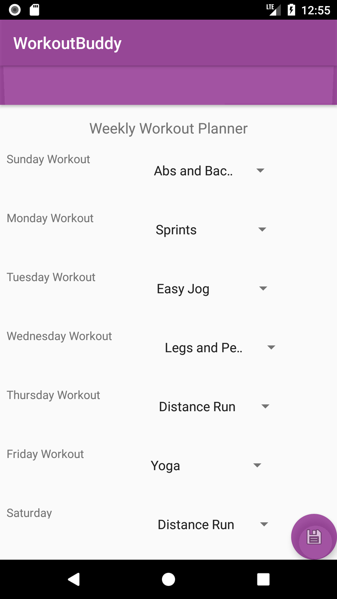

# Workout Partner Finder

ArchHacks 2017 Project

Winner of the **Best Social Hack by Facebook** award

## Purpose

We wanted to find a way to simplify finding workout partners based on different workouts. Workouts included:

- jogging
- walking
- bikeriding
- hiking
- yoga
- weight lifting

But could be expanded. We wanted to make it easier to try new workout types and meet new people and pair based on shared interests.

## Application Walkthrough

An Android Native application

### Login Page

Simple login system, matches against a local SQLite database for prototype sake.

in make an account:

- pick username
- pick password
- pick email address
- //keep it simple and add more info to your profile later

### Setting up preferences

Preferences could be expanded to include:

- Picture
- Bio
- Birthday/age
- Gender
- Accomplishments
- Fitness goals
- Interests
- Preferred workout activities
- Restrictions/disabilities maybe?
- languages

You can also set up a schedule to find matches that fit your workout schedule

)

## Browsing Workout Category Matches

)

- list of people interested in the same activites
- access to their public profile
- ability to message them
- suggested exercises
- // maybe follow them?

Chat With matches

Set expectations and verify that you would be great workout partners

messaging

- suggested approaches (kinda like slackbot)

Potential Gamification:

- leaderboard
- points for successfully completing workout
- points for weight lost

notifications:

- notifications for received messages or matches
